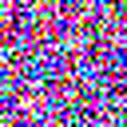
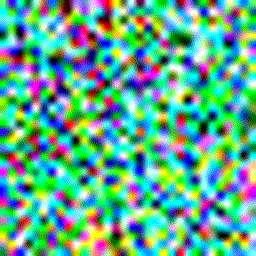
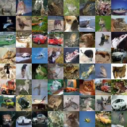
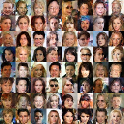
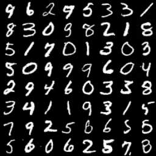
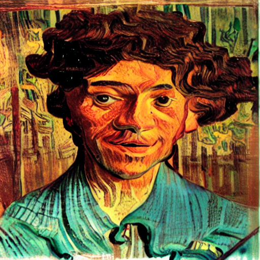

# Implementation of generative models

- [VAE](vae.py) from ["Auto-Encoding Variational Bayes"](https://arxiv.org/abs/1312.6114) (ICLR 2014)

    

- [VQ-VAE](vq_vae.py) from ["Neural Discrete Representation Learning"](https://arxiv.org/abs/1711.00937) (NeurIPS 2017)

    
    

- [ProGAN](progan.py) from ["Progressive Growing of GANs for Improved Quality, Stability, and Variation"](https://arxiv.org/abs/1710.10196) (ICLR 2018)

    <table>
        <tr>
            <th>CIFAR10 32x32</th>
            <th>AFHQ 256x256</th>
        </tr>
        <tr>
            <td></td>
            <td></td>
        </tr>
    </table>

- [IADB](iabd.py) from ["Iterative α-(de)Blending: a Minimalist Deterministic Diffusion Model"](https://arxiv.org/abs/2305.03486) (SIGGRAPH 2023)

    <table>
        <tr>
            <th>CIFAR10 32x32</th>
            <th>CelebA  32x32</th>
            <th>MNIST   32x32</th>
        </tr>
        <tr>
            <td></td>
            <td></td>
            <td></td>
        </tr>
    </table>

- [IP-Adapter](sd_lora.py) from ["IP-Adapter: Text Compatible Image Prompt Adapter for Text-to-Image Diffusion Models"](https://arxiv.org/abs/2308.06721) (arxiv 2023)

    <table>
        <tr>
            <td></td>
            <td></td>
            <td></td>
            <td></td>
        </tr>
    </table>
- [LoRA](sd_lora.py) from ["LoRA: Low-Rank Adaptation of Large Language Models"](https://arxiv.org/abs/2106.09685) (ICLR 2022)

    <table>
        <tr>
            <td></td>
            <td></td>
        </tr>
    </table>
