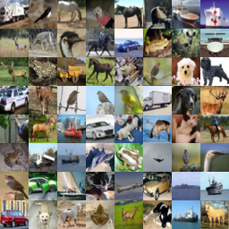
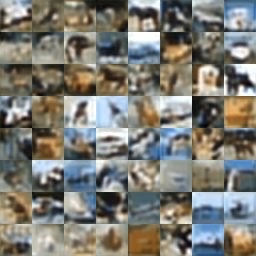
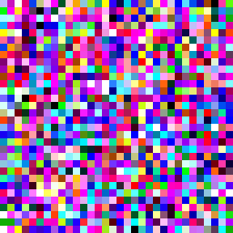

# Generative Models

- [VAE](vae.py) from ["Auto-Encoding Variational Bayes"](https://arxiv.org/abs/1312.6114) Diederik P. Kingma, Max Welling.

    <table>
        <tr>
            <th>Frey Faces 28x20</th>
        </tr>
        <tr>
            <td></td>
        </tr>
    </table>

- [VQ-VAE](vq_vae.py) from ["Neural Discrete Representation Learning"](https://arxiv.org/abs/1711.00937) Aaron van den Oord, Oriol Vinyals, Koray Kavukcuoglu.

    <table>
        <tr>
            <th>CIFAR10 32x32</th>
            <th>Reconstructed</th>
        </tr>
        <tr>
            <td></td>
            <td></td>
        </tr>
    </table>

- [ProgressiveGAN](progan.py) from ["Progressive Growing of GANs for Improved Quality, Stability, and Variation"](https://arxiv.org/abs/1710.10196) Tero Karras, Timo Aila, Samuli Laine, Jaakko Lehtinen

    <table>
        <tr>
            <th>CIFAR10 32x32</th>
        </tr>
        <tr>
            <td></td>
        </tr>
    </table>